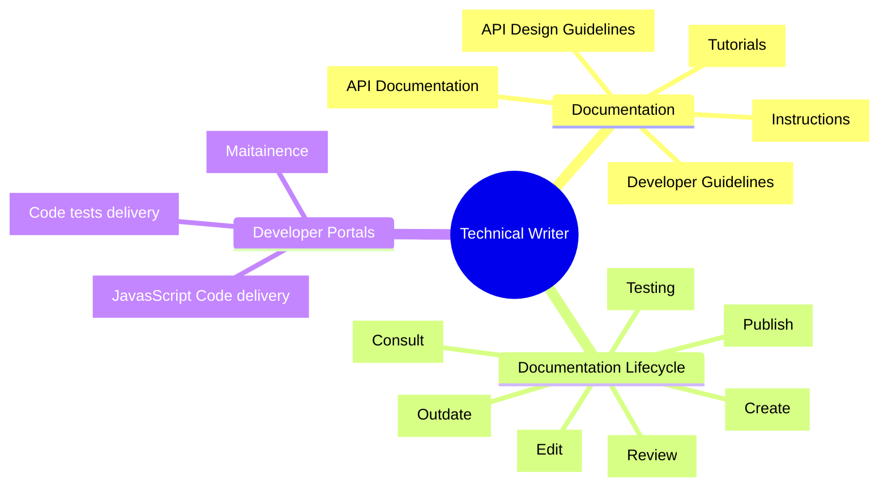
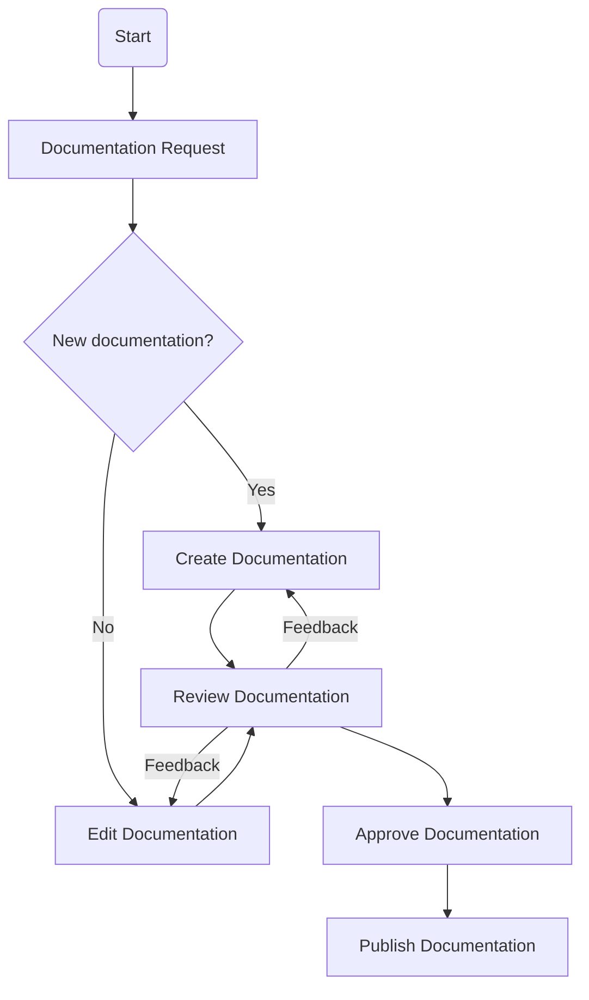
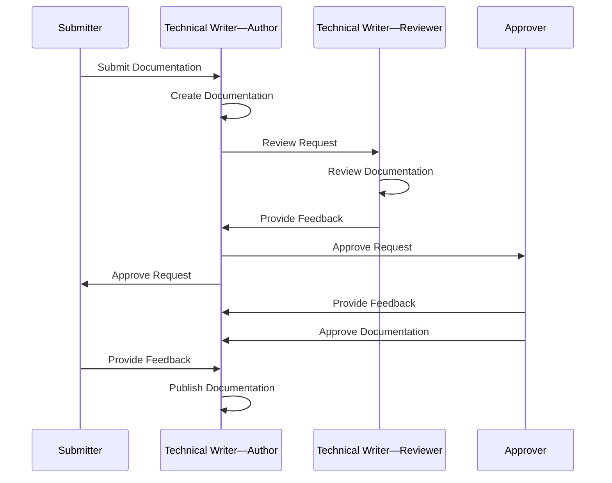

# Documentation Review Process for Technical Writers

## Introduction

This document describes the process for reviewing documentation written by technical writers. The review process is an essential part of the documentation workflow, as it ensures that the documentation is accurate, clear, and consistent.

## Scope of Technical Writer activities

The technical writer is responsible for creating and maintaining the documentation for the product or service and another support matter. 

The technical writer's activities include:
 - Providing `developer guidelines`, `API design guidelines`, `instructions`, `tutorials`, `API documentation`.
 - Reviewing and updating existing documentation and ensuring accuracy.
 - Collaborating with subject-matter experts (`Developers`, `Architects`, `Product Owners`) to gather information.
 - Following `style and formatting guidelines`. <!--(document to be created)-->
 - Publishing the documentation and making it available to users.
 - Maintaining Developer Portals.
 - Devlivering JavaScript code which helps modify API documentation on the fly.

## Purpose

The purpose of the documentation review process is to ensure that the documentation meets the following criteria:
 - Accuracy: The information provided in the documentation is correct and up to date.
 - Clarity: The documentation is easy to understand and follow.
 - Consistency: The documentation follows the established style and formatting guidelines.
 - Completeness: The documentation covers all the necessary information and steps.
 - Relevance: The documentation is relevant to the focus audience and addresses their needs.
 - Accessibility: The documentation is accessible and easy to find.
 - Usability: The documentation is user-friendly and helps users achieve their goals.
 - Quality: The documentation is of high quality and meets the expected standards.

   
## Roles and Responsibilities

The documentation review process involves the following roles and responsibilities:
 - **Submitter**: Submits the documentation for review.
 - **Technical Writer—Author**: Writes and edit the documentation and submits it for review.
 - **Technical Writer—Reviewer**: Reviews the documentation and provides feedback.
 - **Approver**: Approves the documentation for publishing.

## Documentation Review Process

The documentation review process consists of the following steps:
- **Submit Documentation**: The technical writer submits the documentation for review.
- **Review Documentation**: The reviewer reviews the documentation for accuracy, clarity, and consistency.
- **Provide Feedback**: The reviewer provides feedback on the documentation, highlighting any issues or areas for improvement.
- **Revise Documentation**: The technical writer revises the documentation based on the feedback received.
- **Approve Documentation**: The approver reviews the revised documentation and approves it for publishing.
- **Publish Documentation**: The documentation is published and made available to users.

## Documentation Review Checklist

The following checklist can be used during the documentation review process to ensure that the documentation meets the required standards:
- [x] Is the information accurate and up to date?
- [x] Is the documentation clear and easy to understand?
- [x] Does the documentation follow the established style and formatting guidelines?
- [x] Are all the necessary steps and information included?
- [x] Is the documentation relevant to the focus audience?
- [x] Is the documentation accessible and easy to find?
- [x] Is the documentation user-friendly and helpful?
- [x] Does the documentation meet the expected quality standards?

## Conclusion

The documentation review process is an essential part of the documentation workflow, as it ensures that the documentation meets the required standards and provides value to the users. By following the review process and checklist, technical writers can create high-quality documentation that is accurate, clear, and consistent.

For more information on the documentation review process, please refer to the CDQ Developer Portal.

